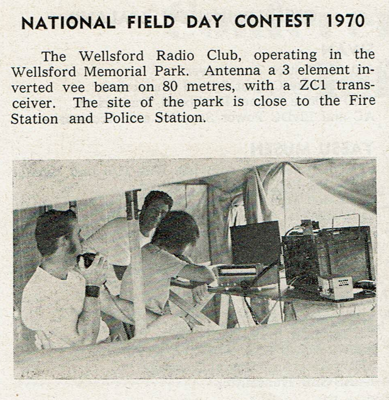
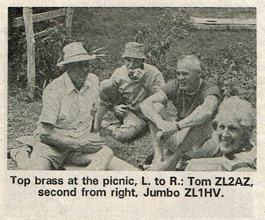
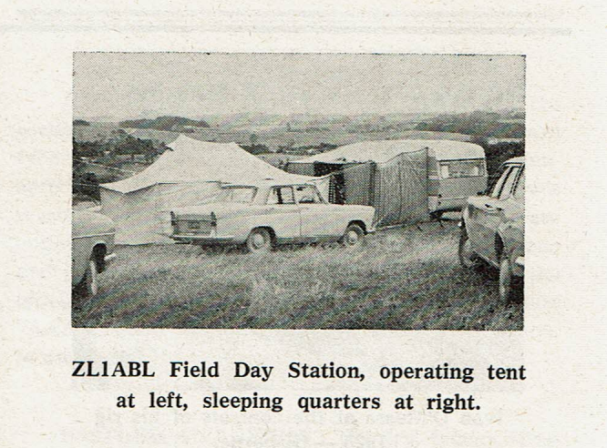
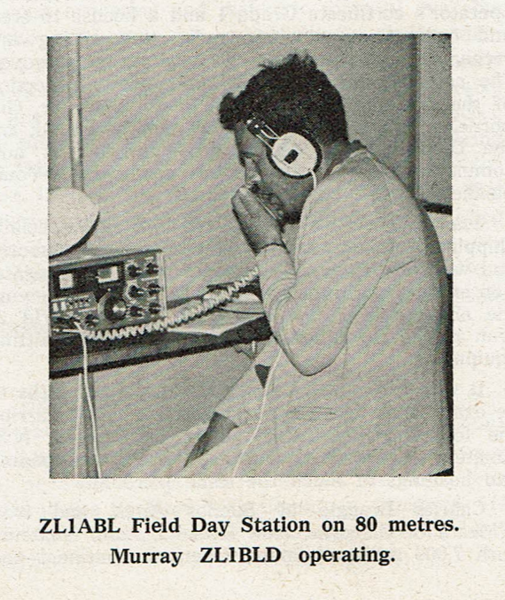
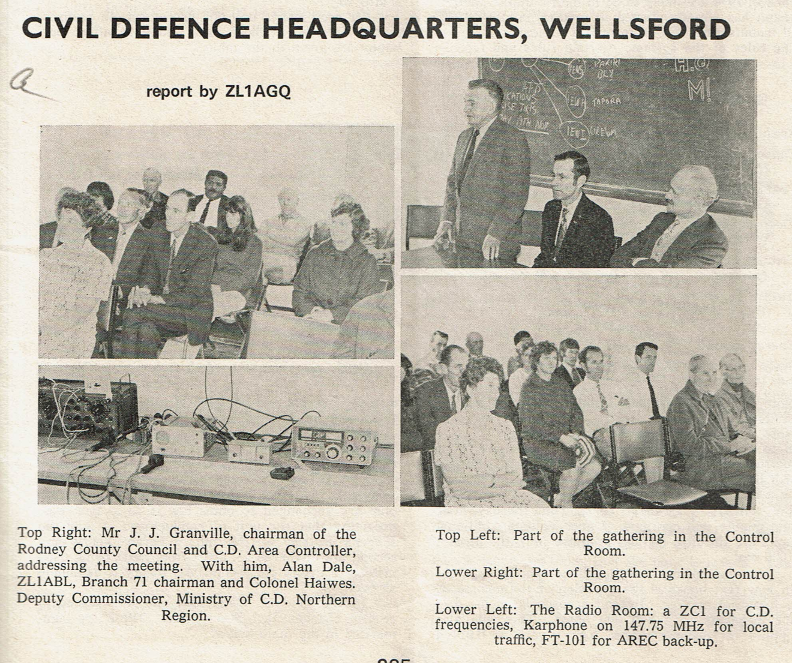

## Club History

RARC started life as the Wellsford Radio Club in the 1950's by its founders, Eycke Zimmerman ZL1AGQ and Alan Dale ZL1ABL.
Alas Alan and Eycke are no longer with us. Those initial meetings first took place in Eycke's basement but later moved to an almost derelict council building in School Road Wellsford - the same location was also the CD HQ for the area.

Whilst RARC today does not currently have Amateur Radio classes to help and train budding operators, the Wellsford Radio Club did. It's first student was Bill Tester ZL1AHK and he became an operator for many years. An article from the Break-In magazine of November 1970 highlights [what went on during those classes](./assets/pdf/break-in_nov_1970.pdf).

The Wellsford Radio Club became [Branch 71, a branch of the NZART in June 1972](./assets/pdf/break-in_sept_1972.pdf). In the seventies the club became known as the Rodney Amateur Radio Club and this was about the same time as the meeting location changed to the Scout Hall in Warkworth. Brian Nelson ZL1AZU of Warkworth was a very active member during this time doing repeater work.

The club knew how to enjoy themeselves back then as this Break-In magazine article showed during the [Branch 71 Picnic to Kawau Island in 1975](./assets/pdf/break-in_april_1975.pdf). The last couple of paragraphs summed the trip up,

> The afternoon concluded all too soon with afternoon tea at Ron's house and subsequent embarkation for the return trip, back to the hustle and bustle of the mainland. Thank you Ron, for so graciously facil- litating the invasion of your privacy by such a mob of eager beavers. All those present enjoyed the day.
Moral of the story: when next Branch 71 holds a picnic, put on your running shoes, pack your lunch and togs and come along. A pleasant relaxing day is promised to one and all.

## National Field Day 1972 - Station ZL1ABL

## Civil Defence Meeting in Wellsford 1973

In the lower right photo of the CD meeting there is Bill Tester ZL1AHK seated on the far left at the back. Next to Bill Tester is Bruce Rowling ZL1WB (SK) who travelled many miles from his home QTH in Whangarei in support of Amateur radio, the club, AREC and CD.
