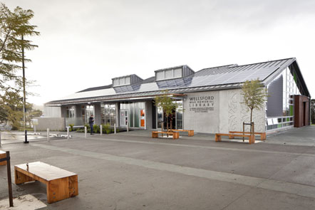

## Our Meeting Place
Rodney Amateur Radio Club meets once a month in the "Meeting Room" at the Wellsford Memorial Library.
Meetings usually take place at 10am on the second Saturday of every month with the exception of December,
where it is the first Saturday of the month and, January when there is no meeting. Tea, coffee and sugar are provided free.

The Wellsford Memorial Library is a remarkable facility that has 125 solar panels on the roof to generate its power and supply
any surplus to the mains. There is under floor heating by water heated from solar power and it has four mini
turrets’ with automatically controlled louvers. There are automatically controlled fans and lights.

The meeting room comes complete with a data projector, 50 inch TV and a DVD/Blue Ray Player. There is also an
electronic whiteboard available which can produce copies, on paper, of anything written or drawn on the whiteboard.

To complete this awesome venue, outside there are charging points for electric cars.
