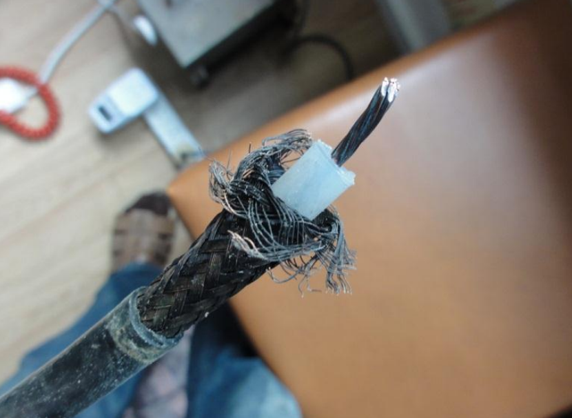
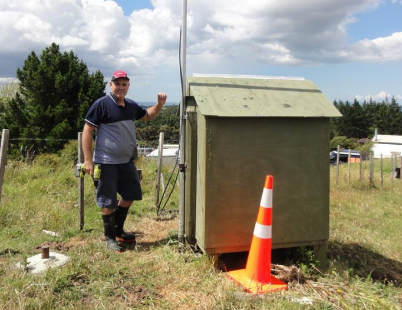

## 2018 Upgrade for the 730 Repeater

In the latter half of 2017 our repeater started having intermittent issues which gradually increased in severity.
Mike (ZL1MRC) found out that the SWR had worsened over time and actually rose up to a non-acceptable level. We had to
take the repeater offline to prevent it from overloading and causing further damage due to the very high SWR.

Taking the antenna down, we saw cracks and suspected water ingress. The coax cable looked very poor and showed
corrosion too. The build of the antenna was such that it was never meant to be serviced or disassembled so there was
no hope for any fix. We decided it was time to go shopping and get ourselves a new antenna. Our repeater trustee
Mike ZL1MRC ordered one and quickly received a brand new DP-CP22E VHF collinear from the Com-Centre in Auckland.

Mike then performed some final tuning steps (that turned out to be quite tricky) then he waterproofed and secured all.
The old RG213 cable was replaced with good quality LMR-400 and new high quality connectors.

On a sunny morning Mike installed the new antenna at the repeater site and since then we get amazing good reports.
The best one I have heard was that someone covered the repeater from inside the Puhoi tunnel. Good reports
from Wellsford to South Auckland are all reassuring that we did a great job with the new aerial.

Thank you Mike - You are a great and competent Repeater Trustee!

